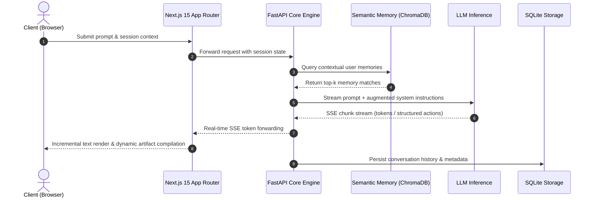
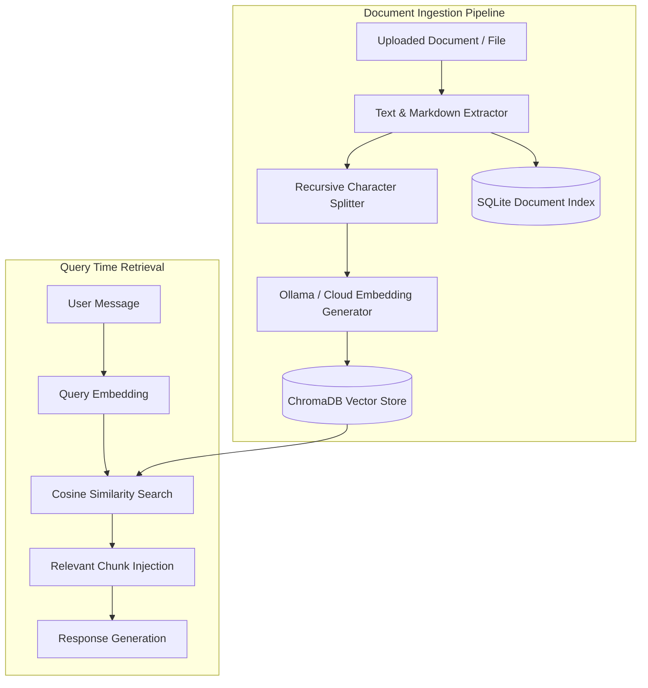
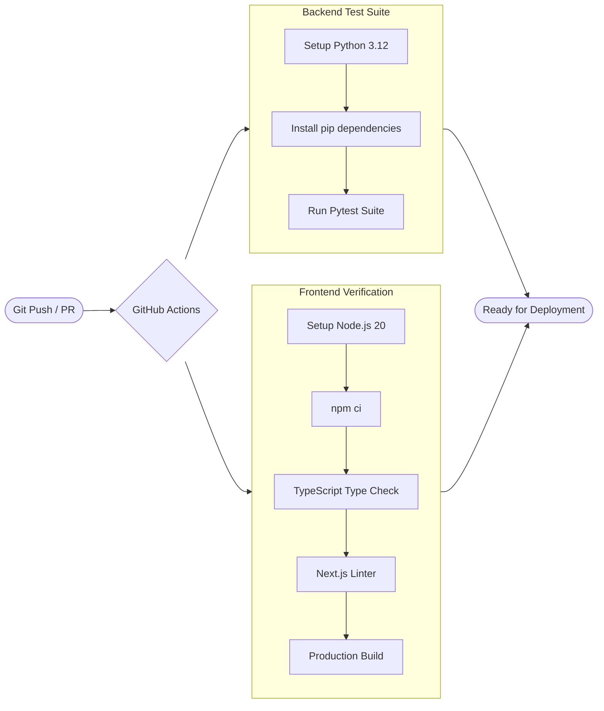
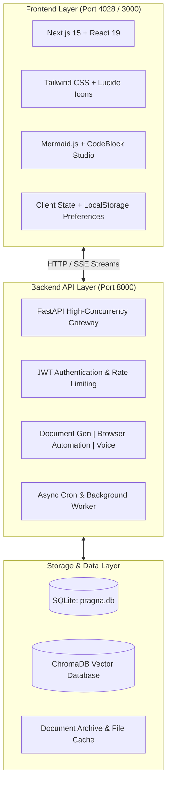

# PRAGNA 1-A

> Intelligent, high-performance AI workspace and conversational operating environment.

[](https://nextjs.org/)
[](https://react.dev/)
[](https://fastapi.tiangolo.com/)
[](https://python.org)
[](https://www.trychroma.com/)

---

## Overview

**PRAGNA 1-A** is a full-stack AI platform combining conversational intelligence with real-time artifact visualization, document generation, semantic search, browser exploration, voice synthesis, and dynamic task management.

Built for velocity, reliability, and precision, PRAGNA 1-A pairs an ultra-responsive Next.js 15 frontend with a high-concurrency FastAPI engine, SQLite persistence, and ChromaDB vector search.

---

## Wireframes & User Interface

### 1. Main Workspace & Artifact Studio (Desktop)

```text
+---------------------------------------------------------------------------------------------------------+
| [=] PRAGNA 1-A Workspace      [ Model: Gemma-4 / Claude / DeepSeek v ]     (Settings) (Tasks) [User Profile] |
+------------------+----------------------------------------------------+------------------------------------+
| SIDEBAR          | CHAT CONVERSATION VIEW                             | ARTIFACT STUDIO                    |
|                  |                                                    |                                    |
| [+ New Chat]     |  User:                                             |  [ Code ] [ Preview ] [ Export ]   |
|                  |  Build an interactive architecture diagram.        |  --------------------------------  |
| FOLDERS          |                                                    |  flowchart TD                      |
| > Work           |  PRAGNA 1-A:                                       |    A[Client] --> B[Gateway]        |
| > Research       |  Here is the architecture specification. I have    |    B --> C[(Vector DB)]            |
| > Drafts         |  rendered the interactive diagram on the right.    |                                    |
|                  |                                                    |  +------------------------------+  |
| RECENT SESSIONS  |  [Status: Processing execution completed]          |  |                              |  |
| - Market Study   |                                                    |  |      [ MERMAID PREVIEW ]     |  |
| - API Design     |  ------------------------------------------------  |  |                              |  |
| - DB Schema      |                                                    |  +------------------------------+  |
|                  |                                                    |  Actions:                          |
|                  |                                                    |  [ Copy ]  [ Download SVG ]        |
|                  |  +----------------------------------------------+  |  [ Create Document ]               |
|                  |  | Message PRAGNA 1-A...              (Mic) [>] |  |                                    |
|                  |  +----------------------------------------------+  |                                    |
+------------------+----------------------------------------------------+------------------------------------+
```

### 2. Task & Workflow Board (Kanban View)

```text
+---------------------------------------------------------------------------------------------------------+
| [<- Back to Chat]                  PRAGNA 1-A Task Management Board                  [+ Create Task]  |
+-----------------------------------+-----------------------------------+---------------------------------+
| BACKLOG                           | IN PROGRESS                       | COMPLETED                       |
+-----------------------------------+-----------------------------------+---------------------------------+
| [TASK-101]                        | [TASK-098]                        | [TASK-084]                      |
| Ingest Q3 Financial Reports       | Scrape Developer Docs             | Vector index benchmark          |
| Tag: RAG | Priority: High         | Tag: Browser | Priority: Medium   | Tag: ChromaDB | Priority: Low   |
|                                   |                                   |                                 |
| [TASK-102]                        |                                   | [TASK-092]                      |
| Generate Executive Summary Slides |                                   | OAuth login integration         |
| Tag: Presentation                 |                                   | Tag: Auth | Priority: High      |
+-----------------------------------+-----------------------------------+---------------------------------+
```

### 3. Mobile Responsive Layout

```text
+-----------------------------------+
| [=] PRAGNA 1-A           (Avatar) |
+-----------------------------------+
| Assistant:                        |
| Retrieval complete. 3 sources     |
| referenced from knowledge store.  |
|                                   |
| User:                             |
| Summarize section 2.              |
|                                   |
| Assistant:                        |
| Section 2 covers vector search    |
| indexing with ChromaDB...         |
|                                   |
| +-------------------------------+ |
| | Message...          (Mic) [>] | |
| +-------------------------------+ |
+-----------------------------------+
| [Chats]  [Artifacts]  [Settings]  |
+-----------------------------------+
```

---

## System Workflows

### 1. End-to-End Chat & Streaming Workflow



### 2. Knowledge Ingestion & Vector Retrieval Workflow



### 3. Continuous Integration Workflow (CI/CD)



---

## How It's Built

PRAGNA 1-A is engineered as a decoupled, modern multi-service architecture prioritizing speed, developer ergonomics, and rock-solid reliability.



### 1. Frontend Stack
- **Framework**: [Next.js 15](https://nextjs.org/) (App Router architecture)
- **UI Engine**: [React 19](https://react.dev/) with React Server Components & Client Hooks
- **Styling**: [Tailwind CSS](https://tailwindcss.com/) with custom responsive design & neural vortex animation canvas
- **Syntax & Diagrams**: Dynamic [Mermaid.js](https://mermaid.js.org/) rendering, Prism syntax highlighting, and KaTeX math formatting
- **Icons & Visuals**: [Lucide React](https://lucide.dev/)

### 2. Backend Stack
- **Framework**: [FastAPI](https://fastapi.tiangolo.com/) (Python 3.12) running under Uvicorn
- **Relational Persistence**: SQLite for conversations, users, tasks, and system configurations
- **Vector Search Engine**: [ChromaDB](https://www.trychroma.com/) for semantic retrieval and long-term memory embeddings
- **Web Automation**: Playwright headless browser engine for dynamic page inspection and content extraction
- **Document Processing**: Custom multi-format generator supporting PDF, DOCX, XLSX, and presentation files
- **Speech & Audio**: Voice capture, transcription, and speech synthesis services

### 3. Key Subsystems

| Subsystem | Responsibility |
| :--- | :--- |
| **Artifact Studio** | Live code sandboxing, interactive diagrams, and instant file generation directly from chat stream. |
| **Semantic Memory** | Cross-session preference recall and contextual user knowledge indexing using vector similarity. |
| **Knowledge Base (RAG)** | Automated document ingestion, recursive chunking, and similarity ranking. |
| **Browser Exploration** | Headless DOM parsing, screenshot capture, and web page content synthesis. |
| **Task Management** | Integrated Kanban board for organizing multi-step activities and background jobs. |
| **Rate Limiter & Guard** | In-memory token bucket rate limiting and payload validation protecting core endpoints. |

---

## Repository Structure

```text
pragna/
├── .github/
│   └── workflows/
│       └── ci.yml              # Automated testing and build validation pipeline
├── backend/
│   ├── app/
│   │   ├── routes/             # REST endpoints (chat, docs, auth, voice, tasks, etc.)
│   │   ├── artifact_service.py # Artifact management and exports
│   │   ├── browser_service.py  # Playwright browser automation
│   │   ├── chat_service.py     # Conversation orchestration and model routing
│   │   ├── db.py               # SQLite connection pool and schema migrations
│   │   ├── document_generator.py# PDF, Word, Excel, and Slide generators
│   │   ├── memory_service.py   # ChromaDB-backed semantic user memory
│   │   ├── rag.py              # Document ingestion and vector embeddings
│   │   ├── rate_limit.py       # Request throttling middleware
│   │   └── repository.py       # SQL data access layer
│   ├── tests/                  # Pytest verification suites
│   ├── Dockerfile              # Backend container definition
│   └── requirements.txt        # Python production dependencies
├── frontend/
│   ├── src/
│   │   ├── app/                # Next.js routes (chat, settings, tasks, share)
│   │   ├── components/         # Reusable UI widgets and layout modules
│   │   ├── context/            # Global React application state
│   │   └── lib/                # Utility helpers, streaming clients, API wrappers
│   ├── Dockerfile              # Frontend container definition
│   └── package.json            # Node.js dependencies and run scripts
├── docker-compose.yml          # Multi-container orchestration
└── run.sh                      # Local startup script
```

---

## Getting Started

### Prerequisites
- **Node.js**: v20.x or later
- **Python**: v3.12 or later
- **Docker & Docker Compose** (optional, recommended for production)

### Quick Start with Docker

```bash
# 1. Clone repository
git clone https://github.com/vinay3254/pragna.git
cd pragna

# 2. Build and run services
docker compose up --build
```
Access the application at `http://localhost:4028` (or `http://localhost:3000`).

---

### Manual Setup (Local Development)

#### 1. Backend Setup

```bash
cd backend

# Create and activate virtual environment
python3.12 -m venv .venv
source .venv/bin/activate  # On Windows: .venv\Scripts\activate

# Install dependencies
pip install -r requirements.txt
pip install -r requirements-dev.txt

# Configure environment variables
cp .env.example .env

# Run development server
uvicorn app.main:create_app --factory --reload --port 8000
```

#### 2. Frontend Setup

```bash
cd ../frontend

# Install dependencies
npm install

# Run development server
npm run dev
```

Open `http://localhost:4028` in your browser.

---

## Testing & Validation

Run comprehensive verification across both tiers:

```bash
# Backend test suite
cd backend
pytest

# Frontend type checking and build test
cd ../frontend
npm run type-check
npm run build
```

---

## License

This project is licensed under the MIT License — see the [LICENSE](LICENSE) file for details.